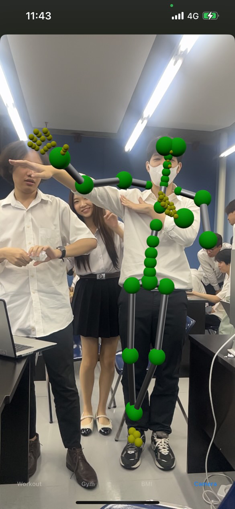

# BodyTracking

A high-performance ARKit-powered diagnostic engine architected to orchestrate real-time human motion tracking and 3D skeletal mapping with sub-millisecond latency.
While the current version utilizes ARKit for spatial body anchors, I am currently researching and implementing a migration to the Vision Framework (VNDetectHumanBodyPoseRequest).Key Advantage upon improving onto Vision framework is that it will allow the engine to function on devices without LIDAR or advanced AR motion sensors, widening the potential user base.

The application is a functional portfolio piece designed for technical demonstration and biomechanical research.

Here's some previews:




## Features

* **Dynamic 3D Skeletal Reconstruction:** Orchestrates real-time body tracking using **ARBodyTrackingConfiguration**, mapping 90+ joints with high-fidelity spatial accuracy.
* **Reactive Diagnostic Overlay:** Engineered a **SwiftUI** interface that provides instantaneous feedback on tracking integrity, subject acquisition, and system health.
* **Intelligent Status Monitoring:** Architected a reactive monitoring system using the **Combine** framework to detect data latency and signal loss in real-time.
* **High-Performance Coordinate Mapping:** Integrated **SIMD (Single Instruction, Multiple Data)** operations for efficient 3D coordinate transformations between physical and virtual space.
* **Immersive UX Implementation:** Employs **Glassmorphism** aesthetics and **Haptic Feedback** loops via `UIImpactFeedbackGenerator` for a premium, tactile user experience.
* **Persistence & Configuration:** Integrated user-specific settings via reactive state management, allowing for real-time adjustments to skeletal rendering and visualization modes.

## Technology Stack

* **Language:** Swift 6.0
* **UI Framework:** SwiftUI (Declarative interface architecture)
* **Augmented Reality:** ARKit (Body Tracking & Scene Reconstruction)
* **3D Rendering:** RealityKit (Entity-Component System for AR visualization)
* **State Management:** Combine (Reactive updates via `@Published` and `ObservableObject`)
* **Pattern:** Coordinator Pattern (Bridging `UIViewRepresentable` with `ARSessionDelegate`)

## Getting Started

### 1. Prerequisites

* **Hardware:** iOS device with A12 Bionic chip or later (e.g., iPhone XS/iPad Air 3+) required for AR Body Tracking.
* **Software:** macOS with Xcode 15.0+ installed.

### 2. Installation & Deployment

```bash
# Clone the repository
git clone https://github.com/HorizonHarry/BodyTracking.git

# Enter project directory
cd BodyTracking

# Open in Xcode
open BodyTracking.xcodeproj

```

### 3. Build Configuration

1. In Xcode, navigate to **Signing & Capabilities**.
2. Select your Development Team to enable code signing.
3. Connect your physical iOS device and press `Cmd + R` to build and deploy.

## Project Structure

```text
BodyTracking/
├── AppState.swift          # Centralized Reactive State (Combine)
├── ARViewContainer.swift   # RealityKit & ARKit Bridge (Coordinator Pattern)
├── BodySkeleton.swift      # 3D Entity Construction & SIMD Logic
├── OverlayView.swift       # SwiftUI Diagnostic & Status Interface
├── ContentView.swift       # Root View & Navigation Hierarchy
├── Assets.xcassets         # 3D Materials & Icon Assets
└── Info.plist              # Camera & AR System Permissions

```

## Configuration

* **Skeletal Logic:** To modify joint mapping or 3D entity behavior, edit `BodySkeleton.swift`.
* **Global State:** To adjust default tracking parameters or UI themes, modify `AppState.swift`.
* **Visual Materials:** Neon effects and **PBR (Physically Based Rendering)** materials are orchestrated within the RealityKit entity logic.

---

*Developed with a focus on high-performance AR integration and reactive software architecture.*